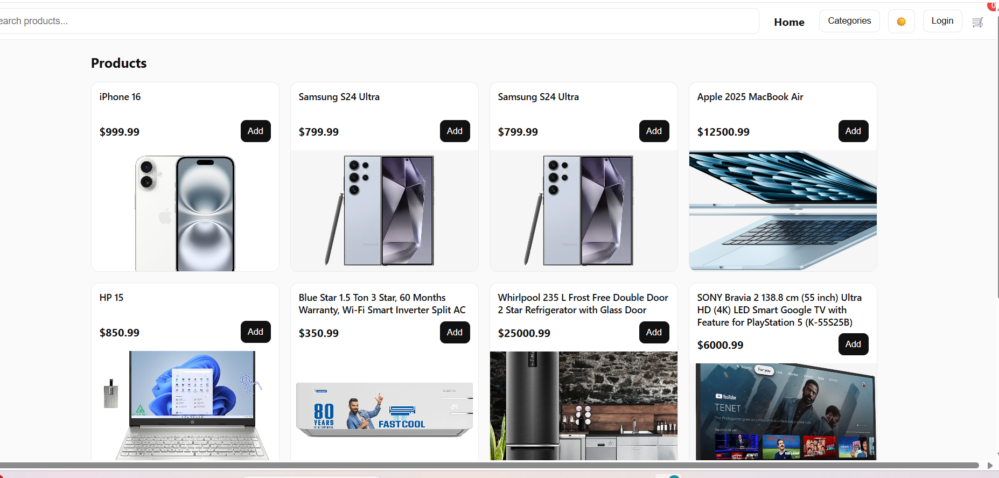

# 🛒 E-Commerce Application

A full-stack **E-Commerce Web Application** built with **Spring Boot (Java)** for the backend and **HTML, CSS, JavaScript** for the frontend.  
This project demonstrates authentication, product management, and cart functionality in a clean architecture, making it a strong portfolio piece.

---

## 🚀 Features

### ✅ Implemented
- **User Login** – users can log in with email & password (validated against database).
- **Product Display** – product details are fetched from backend (Spring Boot + DB).
- **Cart Functionality** – add/remove products to/from the cart.
- **Dark Theme Support** – toggle between light and dark modes.
- **Add Product (Admin/Client)** – owner can add products to database via frontend.
- **Profile Handling** – login button turns into profile after successful login.

### 🔄 In Progress
- **Signup** – allow new users to register.
- **Order Management** – checkout and order history.
- **Admin Dashboard** – better product/user management.

---

## 🛠️ Tech Stack

### Frontend
- HTML5
- CSS3
- JavaScript (Vanilla JS)

### Backend
- Java 17+
- Spring Boot
- Spring Data JPA
- REST APIs

### Database
- MySQL

---

## 📂 Project Structure
ecommerce-project/
├── backend/ # Spring Boot project
│ ├── simpleWebappSpringBoot/
│ ├── src/
│ └── pom.xml
├── frontend/ # Static frontend code
│ ├── ecommerce.html
│ ├── ecommerce.css
│ ├── ecommerce.js
│ ├── login.js
│ ├── addProduct.js
│ └── images/

## ⚡ Getting Started
### Backend
cd backend/simpleWebappSpringBoot
mvn spring-boot:run

### Frontend
Open `frontend/ecommerce.html` in a browser (or run with Live Server in VS Code).
## 📸 Screenshots

### 🏠 Home Page

## 📂 Project Structure

